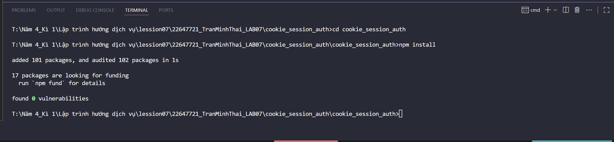
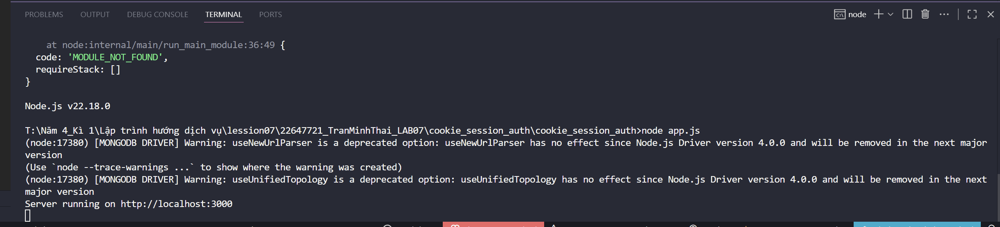

# Demo cookie_session_auth
## Cài đặt
1. cd cookie_session_auth
2. npm start
3. node app.js

## Test với POSTMAN 
4. Post: http://localhost:3000/auth/register
5. body -> raw -> nhập: {"username": "admin", "password": "12345"}

6. Post: http://localhost:3000/auth/login

7. Get: http://localhost:3000/auth/logout

8. GET: http://localhost:3000/auth/profile

## Test với MONGODB
9. Kết nối với localhost:27017
10. Chọn sessionAuth
11. users

12. sessions
